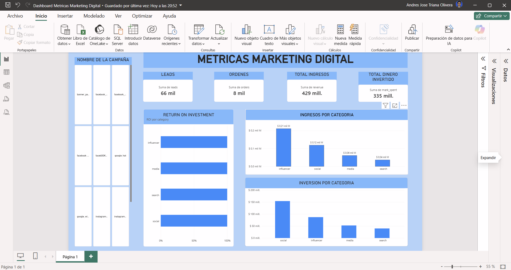

# 📊 Dashboard de Métricas de Marketing Digital

## Descripción

Este proyecto contiene un dashboard de **Métricas de Marketing Digital** desarrollado en **Microsoft Power BI**.

El objetivo principal del dashboard es transformar los datos obtenidos de diferentes campañas de marketing en información visual, permitiendo analizar el rendimiento de las campañas, los ingresos generados, la inversión realizada y el retorno de inversión (ROI).

---

## 🎯 Objetivo

El dashboard fue diseñado para facilitar la toma de decisiones mediante el análisis de indicadores clave de marketing digital.

Permite:

- Analizar el rendimiento de las campañas.
- Medir la cantidad de leads generados.
- Analizar el número de órdenes obtenidas.
- Comparar los ingresos por categoría.
- Analizar la inversión realizada por categoría.
- Evaluar el retorno de inversión (ROI).
- Comparar diferentes canales de marketing.
- Identificar las categorías y campañas con mejor desempeño.

---

## 📌 Principales KPIs

El dashboard presenta cuatro indicadores principales:

| KPI | Valor mostrado |
|---|---:|
| **Leads** | 66 mil |
| **Órdenes** | 8 mil |
| **Total de ingresos** | 429 mil |
| **Total dinero invertido** | 335 mil |

> Los valores pueden variar dependiendo de los filtros o de los datos utilizados en el modelo.

---

## 📈 Visualizaciones

### 1. Retorno sobre la inversión (ROI)

Se utiliza un gráfico de barras horizontales para comparar el **ROI por categoría**.

Las categorías analizadas son:

- Influencer
- Media
- Search
- Social

Esta visualización permite identificar qué categorías presentan un mejor rendimiento respecto a la inversión realizada.

---

### 2. Ingresos por categoría

El dashboard incluye un gráfico de barras para visualizar los ingresos generados por cada categoría.

Las categorías son:

- **Influencer**
- **Social**
- **Media**
- **Search**

Esta visualización facilita la comparación del rendimiento económico de cada canal.

---

### 3. Inversión por categoría

Se presenta un gráfico de barras que permite analizar cómo se distribuye el presupuesto entre las diferentes categorías.

Categorías:

- Social
- Influencer
- Media
- Search

Esto permite identificar qué canales concentran una mayor cantidad de inversión.

---

## 🗂️ Campañas

En el panel lateral izquierdo se encuentra el listado de **nombres de las campañas**.

El usuario puede seleccionar una campaña para analizar sus métricas y observar cómo cambian las diferentes visualizaciones del dashboard.

La interacción con las campañas permite realizar análisis más específicos y comparar el comportamiento de diferentes estrategias de marketing.

---

## 🔎 Interactividad

El dashboard permite realizar un análisis dinámico mediante filtros y selección de campañas.

Entre sus principales funcionalidades se encuentran:

- Selección de campañas.
- Filtrado dinámico de información.
- Análisis de ingresos.
- Análisis de inversión.
- Comparación entre categorías.
- Evaluación del ROI.
- Visualización de KPIs.
- Exploración interactiva de los datos.

---

## 📊 Categorías de Marketing

El análisis está dividido principalmente en cuatro categorías:

```text
Influencer
Social
Media
Search
```

